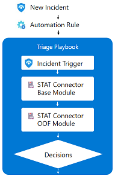
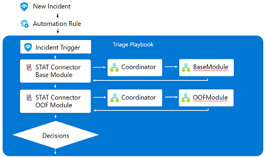

# Sentinel Triage AssistanT (STAT) :hospital: - How it Works

The Sentinel Triage AssistanT consists of 5 components

* Sentinel Playbook (Logic App)
* Logic Apps Custom Connector
* STAT Coordinator
* Automation Modules
* STAT Workbook

## Sentinel Playbook (Logic App)

When a Sentinel incidient is created that requires triage, a Sentinel Playbook will be started using an [automation rule](https://docs.microsoft.com/azure/sentinel/automate-incident-handling-with-automation-rules).  This playbook will start with a Sentinel Incident trigger and be used to call the Sentinel Triage AssistanT through the Logic Apps Custom Connector.  Once the triage information is receieved from STAT, this Playbook can then determine the outcome of the incident.

Here is a high level view of the information flow using STAT:

## Logic Apps Custom Connector

The Logic Apps Custom Connector (STAT Connector) serves as the user interface of STAT.  All automations built on the STAT platform will use this custom connector to retrieve relevant information about the incident and return that information into the Sentinel Playbook for a determination to be made.  The STAT Connector works in a similar way to built-in Logic App connectors so if you already have experience with Logic Apps this will be a familiar interface.

## STAT Coordinator

The STAT Coordinator operates behind the scenes and it does not need to be called or used directly.  This component of the solution serves as a routing engine for the Logic Apps Custom Connector.  Based on the actions chosen in the STAT Connector, the STAT Coordinator will forward the relevant data to the Automation Module and then return the response back to the STAT Connector.

Here is a more detailed look of the information flow, including the coordinator:

## Automation Modules

Today a series of 11 modules have been released for STAT.  These modules also operate behind the scenes but it is important to understand their capabilites to make the best use of the solution.  Each module is responsible for getting specfic insights into the entities associated with the incident and returning those insights in a easy to use format back to the STAT Connector.

When using STAT, the first module you should call from the STAT Connector is the Base Module.  The Base Module performs some enrichment activities to prepare the incident data for the rest of the STAT solution.  All other modules will require inputs from this Base module so they should be called after the Base Module has processed the incident data.

An example of the use of multiple modules can be found in the [Sample](sample.md) playbook included during the deployment.

More information about the automation modules can be located within the [Modules](/Modules/) folders.

## STAT Workbook

The STAT workbook helps you to monitor the overall STAT solution.  The workbook locates the deployed STAT components in your environment and retrieves execution data and returns success/failure information.  In addition, it will also retrieve the version information of your deployed STAT solution and compare it to the publically published versions to see if updates are available.

---
[Documentation Home](readme.md)
