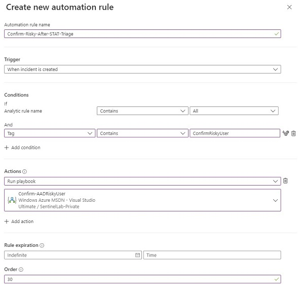

# Sentinel Triage AssistanT (STAT) :hospital: - Remediation

Once you have used STAT to triage your incident and make a decision on the remediation actions you want to take, you may notice that STAT does not include any remediation actions. This is because many common remediation action Playbooks have already been built in the [Sentinel Github repo](https://github.com/Azure/Azure-Sentinel/tree/master/Playbooks).  Since STAT is encouraging reusable automation, it didn't make sense at this time to incorporate remediation directly into STAT.  However, that doesn't mean they can't work together.

## Triggering a Remediation Playbook on STAT Output

Let's say you want to use the [Confirm-AADRiskyUser](https://github.com/Azure/Azure-Sentinel/tree/master/Playbooks/Confirm-AADRiskyUser) playbook on an incident that STAT has triaged as a high risk.  How can I this playbook?

There's actually 2 ways to accomplish this:

* Incident Tags and Automation Rules or
* Run Playbook API

### Incident Tags and Automation Rules

In this approach, you will configure the STAT playbook to tag the incident where you want to run the playbook, and an automation rule to execute the playbook if the Tag is present.

1. In your STAT triage playbook add a Sentinel\Update Incident action to the part of your playbook where a high risk has been determined
2. In that Update incident action, set a tag on the incident such as 'ConfirmRiskyUser'
3. Create a new automation rule that runs after (higher Order #) the STAT triage Playbook which runs the Confirm-AADRiskyUser Playbook
4. Set a Condition on the automation rule for Tag Contains 'ConfirmRiskyUser'

With this configuration the STAT playbook will run first, determine if a the remediation action is needed, and then only if the tag has been added will the remeidation action take place.

### Run Playbook API

Microsoft Sentinel recently introduced a new API endpoint that allows for the running of a playbook on an incident.  In this approach, you would use that API endpoint to trigger the Confirm-AADRiskUser playbook

[Incidents - Run Playbook API Documentation](https://docs.microsoft.com/rest/api/securityinsights/preview/incidents/run-playbook)

> Note: We will be adding a [module](https://github.com/briandelmsft/SentinelAutomationModules/issues/299) in the future to make calling this API easier from STAT.

---
[Documentation Home](readme.md)
