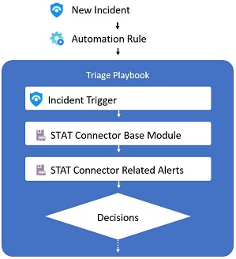
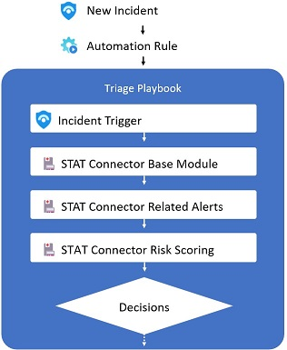
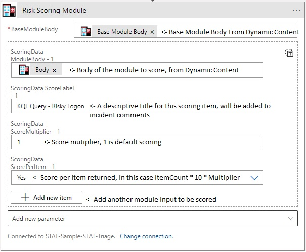

# Sentinel Triage AssistanT (STAT) :hospital: - Risk Scoring

Risk Scoring is a module of STAT that can be used to calculate a cumulative risk score based on the findings of multiple STAT modules. The Risk Scoring module can consume the output *Body* of multiple STAT modules, and will calculate a simple numeric score based on what those modules have found.  Its purpose is to make it easier to make a decision based on the cumulative risk associated with an incident.

## Supported Modules

The Risk Scoring module accepts the *Body* output of the following modules as an input:

* KQL Module
* Related Alerts
* Threat Intel Module
* Watchlist Module

## Risk Scoring Example

For this example let's assume you want to make a decision based on the related alerts to an incident.  While the Related Alerts module will return information about the amount of alerts, the severity of the alerts and other properties influence the risk of the incident.  Without a risk score, it is difficult to analyze these properties in automation.  For example, if there are multiple related high risk alerts you may wish to handle that differently than if there are multiple low or information risk alerts.  

Passing the Related Alerts *Body* through the risk scoring module will return a simple cumulative score based on the number of alerts and severity of each alert. So instead of applying multiple conditions based on the number of alerts and severity of alerts, you can evaluate a simple condition such as TotalScore > 20.

> Note: While this is useful for a module like Related alerts on its own, the Risk Scoring module provides even greater value as it can combine the risk scores from other modules such as Threat Intel, Watchlist and KQL into a single score that can be easily evaluated.

Without the Risk Scoring Module a triage Logic app would look something like this:



With risk scoring added:



## Risk Scoring Inputs

|Input|Expected Values|Description|
|---|---|---|
|AddIncidentComments|True/False (Default:True)|When set to true, the results of the scoring module will be added to the Sentinel Incident Comments|
|Base Module Body|Body (dynamic content)|The Body should be selected from the Dynamic content of the Base-Module response|
|ScoringData-ModuleBody|Body (dynamic content)|The *Body* of a supported module you want to score|
|ScoringData-ScoreMultiplier|Decimal value (1 for default scoring)|Default scores will be multiplied by this value, this can be a negative value which will result in the cummulative score being reduced|
|ScoreingData-ScorePerItem|true/false|true if you want to score the input on a row level (per alert or record)|

The ScoringData may be provided multiple times, for each module you wish to be included in the risk score.  For example, if you want to evaluate Related Alerts and 2 custom KQL queries, you would provide 3 sets of Scoring data.



## Risk Scoring Outputs

The return from the risk scoring module includes a TotalScore which can be easily evaluated in Condition or Switch statements inside your Logic App.  Additionally, a DetailedResults array is returned indicated the modules that contributed to the risk score.

### Sample Return

```
{
  "DetailedResults": [
    {
      "Score": 25,
      "ScoreSource": "Bad Password KQL Query"
    },
    {
      "Score": 10,
      "ScoreSource": "Related Alerts - Initial Access Incident"
    },
    {
      "Score": 5,
      "ScoreSource": "Related Alerts - Multiple Password changes"
    },
    {
      "Score": -10,
      "ScoreSource": "Watchlist - Check for Trusted IP Location"
    }
  ],
  "TotalScore": 30
}
```

## More information

For more information on how the scores are calculated for each module, please see the [Module Page](/Modules/ScoringModule/readme.md).


---
[Documentation Home](readme.md)
