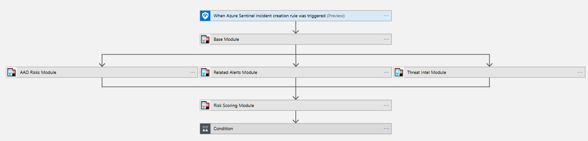

# Sentinel Triage AssistanT (STAT) :hospital: - Sample Playbook

The Sample playbook is a Proof of Concept to demonstrate how STAT can be used to Triage an incident. This sample is not meant to be capable of triaging any type of incident; additional playbooks may need to be built using STAT to handle the unique requirements of different incident types.

The Playbook starts on a Sentinel Incident creation rule trigger and then starts the triage process using STAT:

## Sample Playbook Logic

1. The STAT Base Module is called using the STAT Connector to enrich and prepare the entity data for the STAT Solution
2. In parallel, the AAD Risks Module, Related Alerts Module and Threat Intel Module are called
    * The AAD Risks Module is configured to pass the Base Module response, and lookback 30 days in the Sentinel data for any MFA Fraud reports related to the entities in the triggering incident
    * The Related Alerts Module is configured to pass the Base Module response and check for any Related Sentinel alerts based on matching Account, Host or IP entity data in the last 30 days
    * The Threat Intel Module is configured to pass the Base module response and check for any Related Sentinel Threat Intelligence in the last 30 days based on matching 
    Domain, FileHash, IP, and URL entity data
3. A Condition is then evaluated on the response from STAT to determine if any Related Alerts, Threat Intelligence or MFA Fraud was found
    * If any of these risks are found, the Incident severity is raised and a tag is added with the Triage result
    * If none of these risks are found, the Incident severity is lowered and a tag is added with the Triage result

## Sample Screenshot

---
[Documentation Home](readme.md)