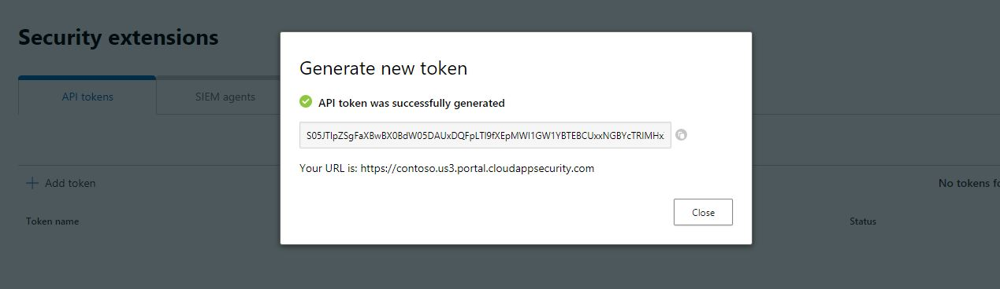

# Get-MCASInvestigationScore

This Logic App retrieve the investigation score for the entities passed in parameters. This leverages only the Account kind of entity. If the incident has multiple accounts, then the results contain an array with the score of each account (if the account has a score in MCAS). The results will also contain a statistics indicating the maximum score of the account passed in parameters. You can specify a threshold for the score and the results will contain the number of account for which the investigation score is going over the specified threshold.

This Logic App be called from a Playbook using the following parameters:

If you chose to enable comment in the incident, an HTML table with the results of the API calls will be added to the incident. 

## Prerequisites

You will need to get two information from your Microsoft Cloud App Security portal.

You need the MCAS API URL. You can get it followinf those steps:

1. Connect to your Microsoft Cloud App Security portal and click on the **Help** menu and then click on **About**. Note the URL mentionned in the screen you will need it when you import the Logic App. 

2. Then click on the **Parameters** menu and select **Security extensions**. Then click on **Add Token**. Note the Token displayed on the screen as you will need it when you import the Logic.

3. When deploying the template, type in the API Key and URL in the corresponding fields.

This will create a Key Vault storing the API Key in the selected resource group. The Logic App will then retrieve the key to query the MCAS API usign the URL you have specified.

## Quick Deployment

## Post Deployment

- Grant the Logic App managed identity the permissions User.Read.All on the Azure Graph API (GrantAPIPermissions.ps1).
- Grant the Logic App managed identity the Azure Sentinel Responder RBAC role on the resource group containing Azure Sentinel.

